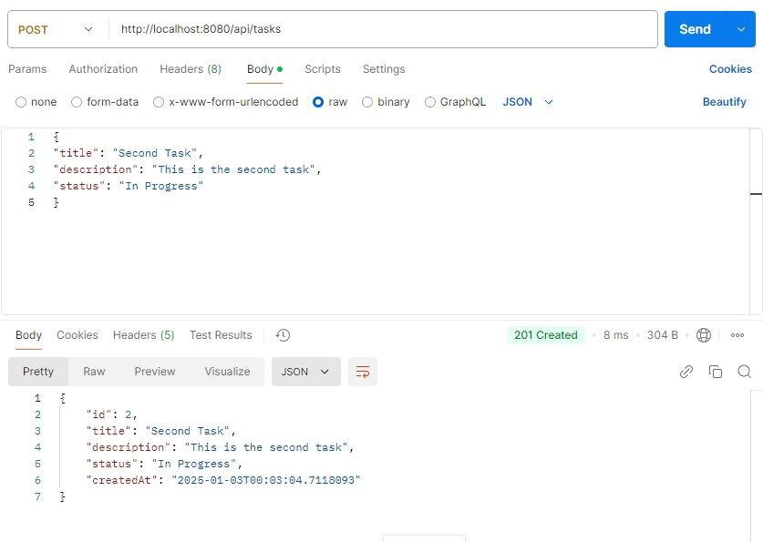

# Практическая работа - RESTful веб-приложение на Spring Boot

**Цель работы** : Создать RESTful веб-приложение “Task Management System” для управления задачами с использованием Spring Boot, применяя ключевые компоненты фреймворка, включая автоматическую конфигурацию, стартеры, работу с базой данных и безопасность.

## План действий

#### 1. Создание проекта
Создала проект с помощью Spring Initializr


#### 2. Настройка базы данных
Настраиваем application.yml: 
```yml
spring.application.name: spring-pract

spring:
  datasource:
    url: jdbc:h2:mem:taskdb
    driverClassName: org.h2.Driver
    username: sa
    password: password
  jpa:
    hibernate:
      ddl-auto: update
  h2:
    console:
      enabled: true

```

#### 3. Создание модели задачи
Создаем пакет model и класс Task (геттеры и сеттеры сделал вручную):

```java
package com.example.spring_pract.model;

import jakarta.persistence.*;
import java.time.LocalDateTime;

@Entity
public class Task {
    @Id
    @GeneratedValue(strategy = GenerationType.IDENTITY)
    private Long id;
    private String title;
    private String description;
    private String status; // Например, "Pending", "In Progress", "Completed"
    private LocalDateTime createdAt;

    public Long getId() {
        return id;
    }

    public void setId(Long id) {
        this.id = id;
    }

    public String getTitle() {
        return title;
    }

    public void setTitle(String title) {
        this.title = title;
    }

    public String getDescription() {
        return description;
    }

    public void setDescription(String description) {
        this.description = description;
    }

    public String getStatus() {
        return status;
    }

    public void setStatus(String status) {
        this.status = status;
    }

    public LocalDateTime getCreatedAt() {
        return createdAt;
    }

    public void setCreatedAt(LocalDateTime createdAt) {
        this.createdAt = createdAt;
    }
}

```
#### 4. Создание репозитория для задач

Создаем пакет repository и класс TaskRepository:

```java
package com.example.spring_pract.repository;

import org.springframework.data.jpa.repository.JpaRepository;
import org.springframework.stereotype.Repository;
import com.example.spring_pract.model.Task;

@Repository
public interface TaskRepository extends JpaRepository<Task, Long> {
}
```
#### 5. Создание REST контроллера

Создаем пакет controller и класс TaskController:

```java
package com.example.spring_pract.controller;

import org.springframework.beans.factory.annotation.Autowired;
import com.example.spring_pract.exception.ResourceNotFoundException;
import org.springframework.web.bind.annotation.*;
import com.example.spring_pract.repository.TaskRepository;
import com.example.spring_pract.model.Task;
import org.springframework.http.HttpStatus;

import java.time.LocalDateTime;
import java.util.List;

@RestController
@RequestMapping("/api/tasks")
public class TaskController {
    @Autowired
    private TaskRepository taskRepository;

    @GetMapping
    public List<Task> getAllTasks() {
        return taskRepository.findAll();
    }

    @PostMapping
    @ResponseStatus(HttpStatus.CREATED)
    public Task createTask(@RequestBody Task task) {
        task.setCreatedAt(LocalDateTime.now());
        return taskRepository.save(task);
    }

    @PutMapping("/{id}")
    @ResponseStatus(HttpStatus.OK)
    public Task updateTask(@PathVariable Long id, @RequestBody Task updatedTask) {
        return taskRepository.findById(id).map(task -> {
            task.setTitle(updatedTask.getTitle());
            task.setDescription(updatedTask.getDescription());
            task.setStatus(updatedTask.getStatus());
            return taskRepository.save(task);
        }).orElseThrow(() -> new ResourceNotFoundException("Task not found with id " + id));
    }

    @DeleteMapping("/{id}")
    @ResponseStatus(HttpStatus.NO_CONTENT)
    public void deleteTask(@PathVariable Long id) {
        if (!taskRepository.existsById(id)) {
            throw new ResourceNotFoundException("Task not found with id " + id);
        }
        taskRepository.deleteById(id);
    }
}
```
#### 6. Тестирование приложения

* Откройте консоль H2 по адресу /h2-console для проверки данных и выполним запрос:
  


* Далее воспользуемся Postman для тестирования CRUD операций:

1. Создадим первую задачу:


2. Получение списка задач:


3. Созданим вторую задачи:



4. Обновление существующей задачи:


5. Удаление задачи:


8. Обновление несуществующей задачи:


